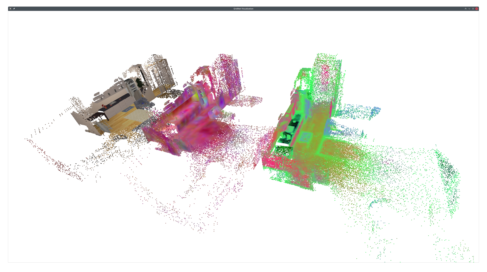
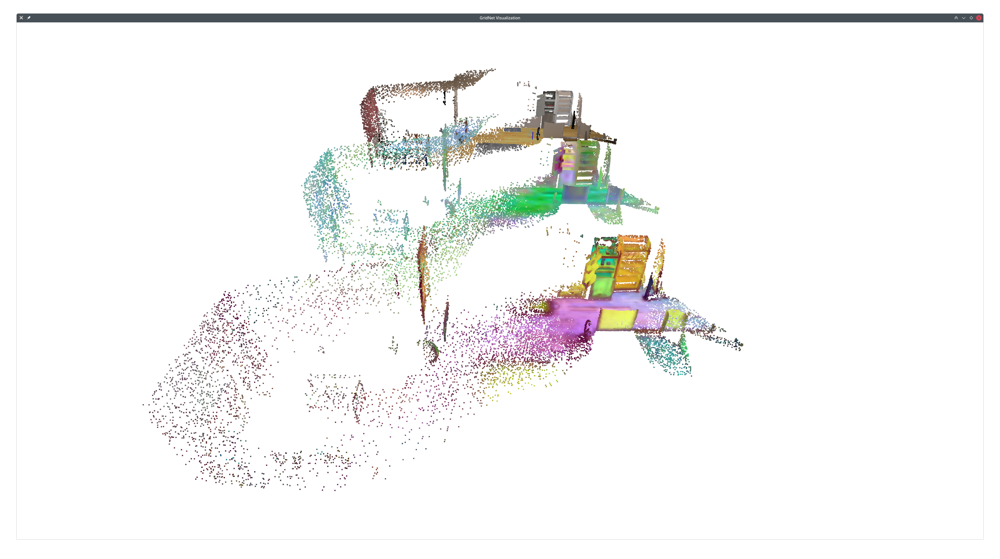
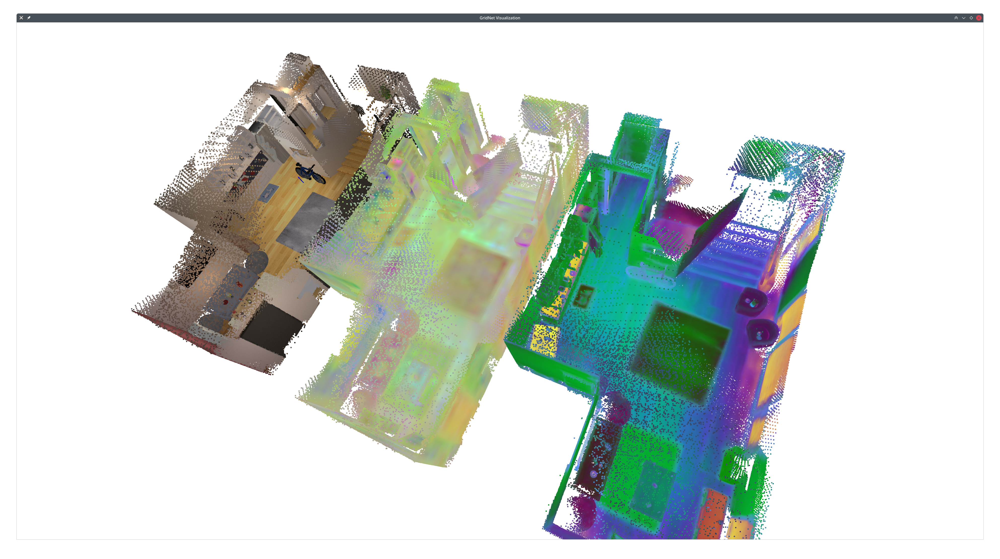

static_mapping
====

1. generate RGB-D data
2. visualize RGB-D data
   ```shell
   python3 rgbd_data_explorer.py --data-file /home/daizhirui/Data/mobile_language_mapping/prepare_groceries/pick/all_static.pt \
        --sensor-names fetch_head fetch_hand --min-depth 0 --max-depth 50 --trajectory-downsample 10 --image-downsample 10
   ```
3. generate clip data
4. train the static mapping model
   - [train_static_map.py](train_static_map.py) (One map for the whole dataset)
   - [train_static_map_per_episode.py](train_static_map_per_episode.py) (One map per episode)
5. visualize the static map
   - GridNet (One map per episode)
    ```shell
    PYTHONPATH=$(pwd)/.. python visualize_static_map.py \
        config/visualize_static_map.yaml \
        cfg.test_model_dir=/home/daizhirui/results/mobile_language_mapping/static_mapping_per_episode/nearest-exact/20250730-095458/best \
        frame_downsample_factor=10 \
        pcd_downsample_factor=10
    ```
    
    - MultiVoxelHashTable (One map per episode)
    ```shell
    PYTHONPATH=$(pwd)/.. python visualize_static_map.py \
        config/visualize_static_map.yaml \
        cfg.test_model_dir=/home/daizhirui/results/mobile_language_mapping/static_mapping_per_episode/nearest-exact/20250802-235137/best \
        frame_downsample_factor=10 \
        pcd_downsample_factor=10
    ```
    
    - VoxelHashTable (One map per scene)
    ```shell
    # scene 10
    PYTHONPATH=$(pwd)/.. python visualize_static_map.py \
        config/visualize_static_map.yaml \
        cfg.test_model_dir=/home/daizhirui/results/mobile_language_mapping_demo/static_mapping/nearest-exact/20250805-123749/best \
        frame_downsample_factor=10 \
        pcd_downsample_factor=10 \
        vertices_fp=vertices_10.ply
    # scene 13
    PYTHONPATH=$(pwd)/.. python visualize_static_map.py \
        config/visualize_static_map.yaml \
        cfg.test_model_dir=/home/daizhirui/results/mobile_language_mapping_demo/static_mapping/nearest-exact/20250805-161838/best \
        frame_downsample_factor=10 \
        pcd_downsample_factor=10 \
        vertices_fp=vertices_13.ply
    ```

    | Scene 10                                  | Scene 13                                  |
    | ----------------------------------------- | ----------------------------------------- |
    |  |  |
